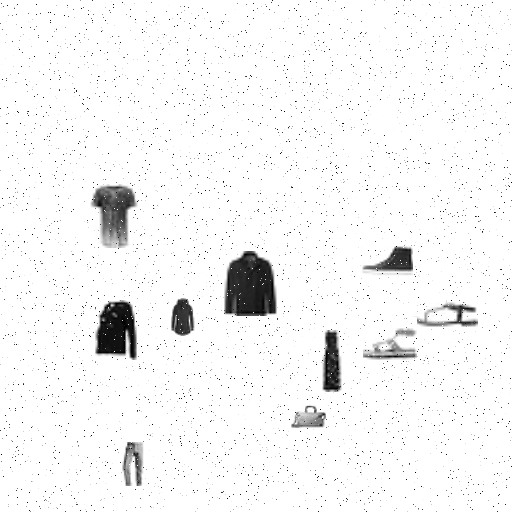
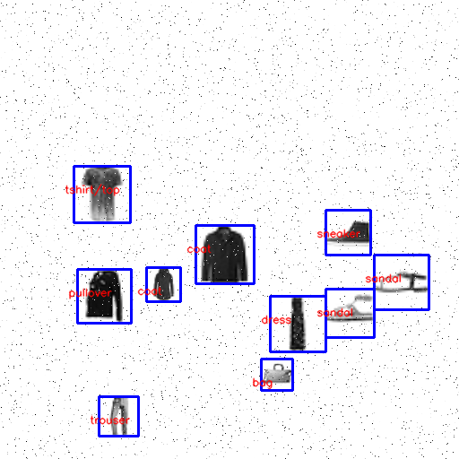
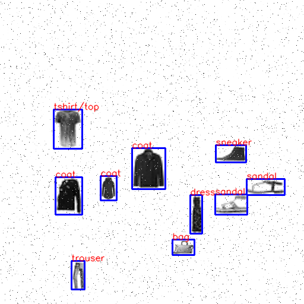
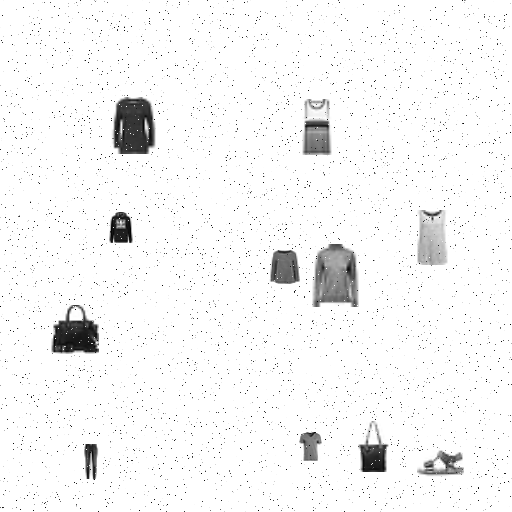
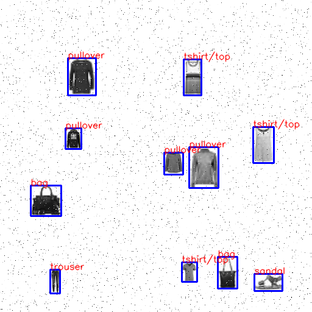
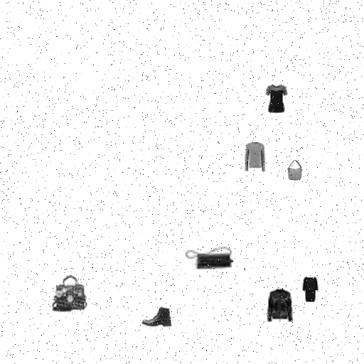
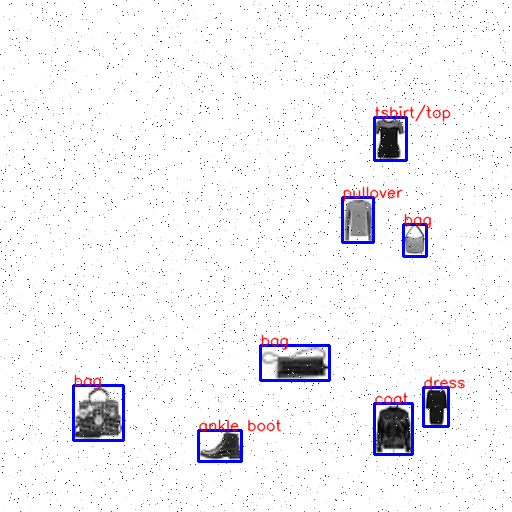

# FashionMNIST Classifier

Fashion-MNIST is a dataset of Zalando's article images—consisting of a training set of 60,000 examples and a test set of 10,000 examples. Each example is a 28x28 grayscale image, associated with a label from 10 classes. Here's an example how the data looks (each class takes three-rows):

## Problem description

Firstly, train the model on the training set of 10000 pictures. Afterwards, recognition of multiple clothing objects on the same picture with noise using the trained model and the OpenCV library. A sample of input/output is given here:

## Solution

### Model

The machine learning algorithm that we use consists of 2 Conv+Pool layers with Dropout (0.5) and a Fully Connected layer with Batch Normalization and Dropout (0.75). A RMS propagation optimizer is used, with Learning rate reduction also being added to the training process. This gives us an accuracy of 90.68% on the test set for the saved model (model.h5). We are not using the whole training set (60000), instead using just 10000 training pictures.

### Processing the large picture

In order to classify the clothing objects scattered across the picture we are given, we must take a few steps to process the image we are given.  
Firstly, we remove noise from the image with OpenCV's built-in method. We will also blur the picture a bit in order to be sure that all noise has been removed.  
Next, we will apply thresholding to the image, making it black and white. This will allows us easier edge detection.  
The edge detection algorithm that we are using is OpenCV's Canny. With the output that it gives us, we use OpenCV's findContours method to aquire the contours of the clothing objects.  
Contours are used for calculating all of the bounding boxes which are then drawn on the picture. Contours that are close to each other are merged into one contour by calculating the convex hull. Contours that are completely inside another contour are ignored.  
Once we have acquired the bounding boxes, we draw them on the output image, which is the same as the input image.  
Finally, we crop out each clothing object (using their bounding boxes) from the original unprocessed image, and we make sure to modify the cropped images to be a square (by adding empty pixels on the shorter side of the picture) and then we scale them down do 28x28. We also make sure to invert the picture, as the model that we have has been trained on white pictures on a black background, and we have black objects on a white background. All that is left is then to put the appropriate label on the image next to each clothing object.

## Results

Here are the results obtained on three test files:

**Test case 1**

**Test case 2**

**Test case 3**

## Usage

The model is trained and saved by running model.py. The model will be saved into the file model.h5.

Tests pictures are located in the folder `tests`. Running the command `main.py X`, where X is an integer will run the recognition program for the picture `X.png`. The result will be saved as `out_X.png`, where the clothing objects and their classes will be pointed out on the output picture.
